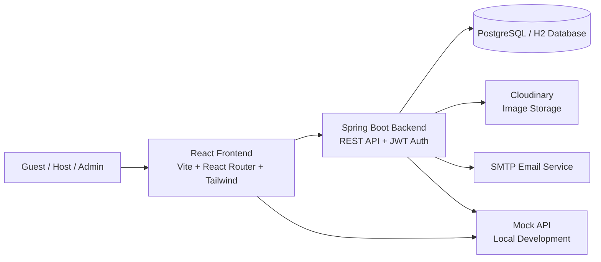

# System Architecture

## Component overview
- Frontend: renders the booking, property, auth, and dashboard experience.
- Backend: exposes APIs for authentication, listings, bookings, reviews, wishlist, and admin operations.
- Database: stores users, properties, bookings, and related domain data.
- Integrations: Cloudinary handles media uploads and SMTP handles transactional emails.
- Mock API: provides local fallback data and development support.
